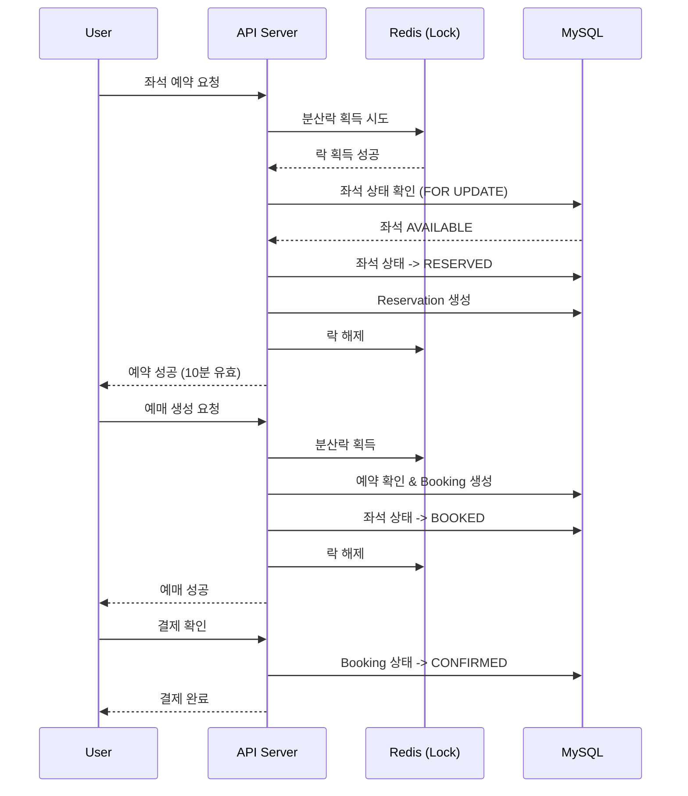

# Ticketing System API

분산락을 지원하는 티케팅 시스템 API 서버입니다.

## 기술 스택

- **Python 3.12** + **uv** (패키지 매니저)
- **FastAPI** - 비동기 웹 프레임워크
- **SQLAlchemy 2.0** - 비동기 ORM
- **MySQL 8.0** - 데이터베이스
- **Redis** - 분산락 및 캐싱
- **Docker** - 컨테이너화

## 주요 기능

### v1 API (현재)
- ✅ Redis 기반 분산락 (Distributed Lock)
- ✅ 낙관적 잠금 (Optimistic Locking)
- ✅ 다중 좌석 원자적 예약
- ✅ 예약 자동 만료 처리
- ✅ 결제 확인 및 취소

### v2 API (예정)
- 🔜 메시지 큐 기반 순서열 처리
- 🔜 우선순위 큐잉
- 🔜 고수요 이벤트 대응

## 프로젝트 구조

```
ticketing-system/
├── app/
│   ├── api/
│   │   └── v1/
│   │       ├── bookings.py      # 예매 API
│   │       ├── events.py        # 이벤트 API
│   │       ├── reservations.py  # 예약 API
│   │       ├── seats.py         # 좌석 API
│   │       └── dependencies.py  # 의존성 주입
│   ├── models/
│   │   ├── booking.py           # 예매 모델
│   │   ├── event.py             # 이벤트 모델
│   │   ├── reservation.py       # 예약 모델
│   │   └── seat.py              # 좌석 모델
│   ├── schemas/                  # Pydantic 스키마
│   ├── services/                 # 비즈니스 로직
│   ├── config.py                # 설정
│   ├── database.py              # DB 연결
│   ├── distributed_lock.py      # 분산락 구현
│   ├── redis_client.py          # Redis 클라이언트
│   ├── tasks.py                 # 백그라운드 작업
│   └── main.py                  # 앱 진입점
├── db/
│   └── init.sql                 # DB 스키마
├── docker-compose.yml
├── Dockerfile
├── pyproject.toml
└── README.md
```

## 설치 및 실행

### 1. 의존성 설치

```bash
uv sync
```

### 2. 환경 변수 설정

```bash
cp .env.example .env
# .env 파일을 수정하여 설정
```

### 3. Docker로 인프라 실행

```bash
# MySQL과 Redis 실행
docker-compose up -d mysql redis
```

### 4. 애플리케이션 실행

```bash
uv run python -m app.main
# 또는
uv run uvicorn app.main:app --reload
```

### 5. Docker Compose로 전체 실행

```bash
docker-compose up -d
```

## API 문서

서버 실행 후:
- Swagger UI: http://localhost:8000/docs
- ReDoc: http://localhost:8000/redoc

## API 엔드포인트

### Events
| Method | Endpoint | Description |
|--------|----------|-------------|
| POST | `/api/v1/events` | 이벤트 생성 |
| GET | `/api/v1/events` | 이벤트 목록 조회 |
| GET | `/api/v1/events/{id}` | 이벤트 상세 조회 |
| PATCH | `/api/v1/events/{id}` | 이벤트 수정 |
| POST | `/api/v1/events/{id}/start-sale` | 판매 시작 |
| POST | `/api/v1/events/{id}/seats` | 좌석 추가 |
| GET | `/api/v1/events/{id}/seats` | 좌석 목록 조회 |
| GET | `/api/v1/events/{id}/seats/available` | 예약 가능 좌석 조회 |

### Reservations
| Method | Endpoint | Description |
|--------|----------|-------------|
| POST | `/api/v1/reservations` | 좌석 예약 (분산락) |
| GET | `/api/v1/reservations` | 내 예약 목록 |
| GET | `/api/v1/reservations/{id}` | 예약 상세 |
| POST | `/api/v1/reservations/{id}/extend` | 예약 연장 |
| DELETE | `/api/v1/reservations/{id}` | 예약 취소 |

### Bookings
| Method | Endpoint | Description |
|--------|----------|-------------|
| POST | `/api/v1/bookings` | 예매 생성 |
| GET | `/api/v1/bookings` | 내 예매 목록 |
| GET | `/api/v1/bookings/{id}` | 예매 상세 |
| GET | `/api/v1/bookings/reference/{ref}` | 예매번호로 조회 |
| POST | `/api/v1/bookings/{id}/confirm-payment` | 결제 확인 |
| POST | `/api/v1/bookings/{id}/cancel` | 예매 취소 |

## 분산락 구현

Redis를 사용한 분산락을 구현하여 동시성 문제를 해결합니다.

### 단일 락
```python
async with distributed_lock(redis, "seat:123") as lock:
    # 임계 영역
    await process_seat_reservation()
```

### 다중 락 (데드락 방지)
```python
async with multi_lock(redis, ["seat:1", "seat:2", "seat:3"]) as lock:
    # 정렬된 순서로 락 획득
    await process_multi_seat_reservation()
```

### 특징
- SET NX EX 패턴으로 원자적 락 획득
- Lua 스크립트로 안전한 락 해제
- 락 소유권 확인 (UUID 토큰)
- 자동 만료 (TTL)
- 재시도 메커니즘

## 티케팅 워크플로우



## 인증

모든 API 요청에는 `X-User-ID` 헤더가 필요합니다.

```bash
curl -X POST http://localhost:8000/api/v1/reservations \
  -H "Content-Type: application/json" \
  -H "X-User-ID: user123" \
  -d '{
    "event_id": 1,
    "seat_ids": [1, 2, 3],
    "user_id": "user123"
  }'
```

## 환경 변수

| 변수 | 설명 | 기본값 |
|-----|------|-------|
| `DEBUG` | 디버그 모드 | `false` |
| `DB_HOST` | MySQL 호스트 | `localhost` |
| `DB_PORT` | MySQL 포트 | `3306` |
| `DB_USER` | MySQL 사용자 | `root` |
| `DB_PASSWORD` | MySQL 비밀번호 | `password` |
| `DB_NAME` | 데이터베이스 이름 | `ticketing` |
| `REDIS_HOST` | Redis 호스트 | `localhost` |
| `REDIS_PORT` | Redis 포트 | `6379` |
| `REDIS_PASSWORD` | Redis 비밀번호 | - |
| `RESERVATION_TIMEOUT_SECONDS` | 예약 만료 시간 | `600` |
| `MAX_SEATS_PER_BOOKING` | 최대 예약 좌석 수 | `10` |
| `LOCK_TIMEOUT_SECONDS` | 락 타임아웃 | `30` |

## 라이선스

MIT License
