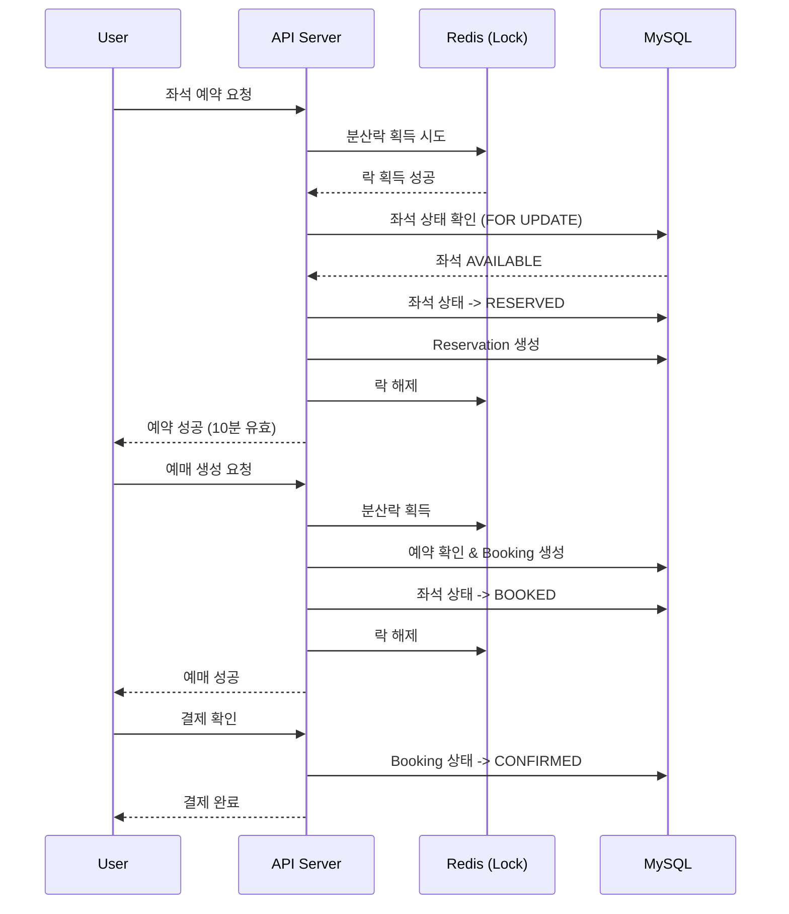
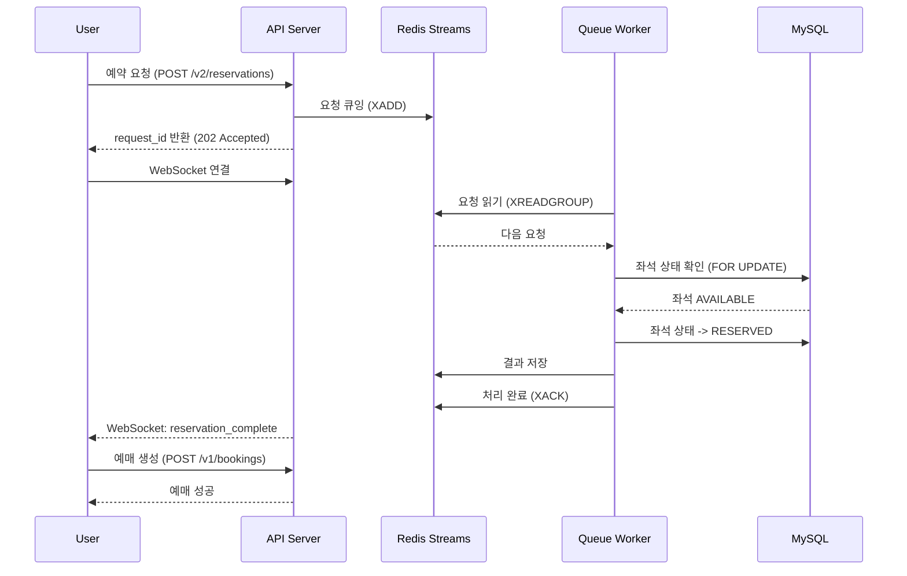

# Ticketing System API

분산락과 메시지 큐를 지원하는 티케팅 시스템 API 서버입니다.

## 기술 스택

- **Python 3.12** + **uv** (패키지 매니저)
- **FastAPI** - 비동기 웹 프레임워크
- **SQLAlchemy 2.0** - 비동기 ORM
- **MySQL 8.0** - 데이터베이스
- **Redis** - 분산락, 메시지 큐 (Redis Streams)
- **Docker** - 컨테이너화

## 주요 기능

### v1 API - 분산락 기반
- ✅ Redis 기반 분산락 (Distributed Lock)
- ✅ 낙관적 잠금 (Optimistic Locking)
- ✅ 다중 좌석 원자적 예약
- ✅ 예약 자동 만료 처리
- ✅ 결제 확인 및 취소

### v2 API - 메시지 큐 기반 ✨ NEW
- ✅ Redis Streams 기반 순서열 처리
- ✅ 우선순위 큐잉 (VIP/일반/낮음)
- ✅ 비동기 요청 처리
- ✅ WebSocket 실시간 상태 업데이트
- ✅ 대기열 통계 및 예상 대기 시간
- ✅ Consumer Group 기반 수평 확장 지원

## 프로젝트 구조

```
ticketing-system/
├── app/
│   ├── api/
│   │   ├── v1/                   # v1 API (분산락 기반)
│   │   │   ├── bookings.py
│   │   │   ├── events.py
│   │   │   ├── reservations.py
│   │   │   ├── seats.py
│   │   │   └── dependencies.py
│   │   └── v2/                   # v2 API (큐 기반)
│   │       ├── reservations.py   # 큐 기반 예약
│   │       ├── queue.py          # 큐 통계
│   │       ├── websocket.py      # 실시간 업데이트
│   │       └── dependencies.py
│   ├── models/                   # SQLAlchemy 모델
│   ├── schemas/                  # Pydantic 스키마
│   │   ├── v2.py                 # v2 전용 스키마
│   │   └── ...
│   ├── services/
│   │   ├── queued_reservation_service.py  # v2 예약 서비스
│   │   └── ...
│   ├── config.py
│   ├── database.py
│   ├── distributed_lock.py       # v1 분산락
│   ├── queue.py                  # v2 Redis Streams 큐
│   ├── redis_client.py
│   ├── tasks.py
│   └── main.py
├── db/
│   └── init.sql
├── docker-compose.yml
├── Dockerfile
├── pyproject.toml
└── README.md
```

## 설치 및 실행

### 1. 의존성 설치

```bash
uv sync
```

### 2. 환경 변수 설정

```bash
cp .env.example .env
# .env 파일을 수정하여 설정
```

### 3. Docker로 인프라 실행

```bash
# MySQL과 Redis 실행
docker-compose up -d mysql redis
```

### 4. 애플리케이션 실행

```bash
uv run python -m app.main
# 또는
uv run uvicorn app.main:app --reload
```

### 5. Docker Compose로 전체 실행

```bash
docker-compose up -d
```

## API 문서

서버 실행 후:
- Swagger UI: http://localhost:8000/docs
- ReDoc: http://localhost:8000/redoc

## API 엔드포인트

### Events
| Method | Endpoint | Description |
|--------|----------|-------------|
| POST | `/api/v1/events` | 이벤트 생성 |
| GET | `/api/v1/events` | 이벤트 목록 조회 |
| GET | `/api/v1/events/{id}` | 이벤트 상세 조회 |
| PATCH | `/api/v1/events/{id}` | 이벤트 수정 |
| POST | `/api/v1/events/{id}/start-sale` | 판매 시작 |
| POST | `/api/v1/events/{id}/seats` | 좌석 추가 |
| GET | `/api/v1/events/{id}/seats` | 좌석 목록 조회 |
| GET | `/api/v1/events/{id}/seats/available` | 예약 가능 좌석 조회 |

### Reservations
| Method | Endpoint | Description |
|--------|----------|-------------|
| POST | `/api/v1/reservations` | 좌석 예약 (분산락) |
| GET | `/api/v1/reservations` | 내 예약 목록 |
| GET | `/api/v1/reservations/{id}` | 예약 상세 |
| POST | `/api/v1/reservations/{id}/extend` | 예약 연장 |
| DELETE | `/api/v1/reservations/{id}` | 예약 취소 |

### Bookings
| Method | Endpoint | Description |
|--------|----------|-------------|
| POST | `/api/v1/bookings` | 예매 생성 |
| GET | `/api/v1/bookings` | 내 예매 목록 |
| GET | `/api/v1/bookings/{id}` | 예매 상세 |
| GET | `/api/v1/bookings/reference/{ref}` | 예매번호로 조회 |
| POST | `/api/v1/bookings/{id}/confirm-payment` | 결제 확인 |
| POST | `/api/v1/bookings/{id}/cancel` | 예매 취소 |

### v2 Reservations (큐 기반)
| Method | Endpoint | Description |
|--------|----------|-------------|
| POST | `/api/v2/reservations` | 예약 요청 큐잉 (비동기) |
| GET | `/api/v2/reservations/{request_id}` | 요청 상태 조회 |
| DELETE | `/api/v2/reservations/{request_id}` | 대기 중 요청 취소 |

### v2 Queue
| Method | Endpoint | Description |
|--------|----------|-------------|
| GET | `/api/v2/queue/stats/{event_id}` | 대기열 통계 |
| GET | `/api/v2/queue/health` | 큐 시스템 상태 |

### v2 WebSocket
| Endpoint | Description |
|----------|-------------|
| `ws://host/api/v2/ws/reservation/{request_id}` | 예약 상태 실시간 업데이트 |
| `ws://host/api/v2/ws/user/{user_id}` | 사용자별 전체 알림 |

## v1 vs v2 비교

| 특성 | v1 (분산락) | v2 (큐 기반) |
|-----|------------|-------------|
| 처리 방식 | 즉시 처리 | 순차 처리 |
| 동시성 제어 | Redis Lock | Redis Streams |
| 응답 시간 | 즉각적 | 비동기 (폴링/WebSocket) |
| 공정성 | Lock 경쟁 | FIFO 순서 보장 |
| 고부하 대응 | Lock 재시도 | 대기열 관리 |
| 우선순위 | 없음 | VIP/일반/낮음 |
| 확장성 | 단일 인스턴스 권장 | Consumer Group 확장 |

### 언제 v1을 사용할까?
- 일반적인 티케팅 상황
- 즉각적인 응답이 필요할 때
- 동시 접속자가 많지 않을 때

### 언제 v2를 사용할까?
- 대규모 티켓 오픈 (콘서트, 스포츠 경기 등)
- 공정한 순서 보장이 필요할 때
- VIP 우선 처리가 필요할 때
- 시스템 과부하 방지가 중요할 때

## 분산락 구현

Redis를 사용한 분산락을 구현하여 동시성 문제를 해결합니다.

### 단일 락
```python
async with distributed_lock(redis, "seat:123") as lock:
    # 임계 영역
    await process_seat_reservation()
```

### 다중 락 (데드락 방지)
```python
async with multi_lock(redis, ["seat:1", "seat:2", "seat:3"]) as lock:
    # 정렬된 순서로 락 획득
    await process_multi_seat_reservation()
```

### 특징
- SET NX EX 패턴으로 원자적 락 획득
- Lua 스크립트로 안전한 락 해제
- 락 소유권 확인 (UUID 토큰)
- 자동 만료 (TTL)
- 재시도 메커니즘

## v2 큐 시스템 구현

Redis Streams를 사용한 메시지 큐 기반 순서열 처리 시스템입니다.

### 아키텍처

```
┌─────────────┐     ┌─────────────────┐     ┌─────────────┐
│   Client    │────▶│   API Server    │────▶│   Redis     │
└─────────────┘     └─────────────────┘     │   Streams   │
                            │               └──────┬──────┘
                            │                      │
                    ┌───────▼───────┐              │
                    │    Worker     │◀─────────────┘
                    │  (Consumer)   │
                    └───────┬───────┘
                            │
                    ┌───────▼───────┐
                    │    MySQL      │
                    └───────────────┘
```

### 우선순위 큐

```python
# 각 이벤트별로 3개의 우선순위 스트림
ticketing:queue:{event_id}:high    # VIP 사용자
ticketing:queue:{event_id}:normal  # 일반 사용자
ticketing:queue:{event_id}:low     # 배치 처리
```

### 사용 예시

```python
# v2 예약 요청 (큐에 추가)
response = await client.post(
    "/api/v2/reservations",
    json={
        "event_id": 1,
        "seat_ids": [1, 2, 3],
        "user_id": "user123",
        "priority": "normal"
    },
    headers={"X-User-ID": "user123"}
)
# 응답: {"request_id": "01HXYZ...", "status": "pending"}

# 상태 폴링
status = await client.get(f"/api/v2/reservations/{request_id}")
# 응답: {"status": "completed", "result": {...}}
```

### WebSocket 실시간 업데이트

```javascript
const ws = new WebSocket(
    `ws://localhost:8000/api/v2/ws/reservation/${requestId}?user_id=user123`
);

ws.onmessage = (event) => {
    const message = JSON.parse(event.data);
    switch (message.type) {
        case "status_update":
            console.log("상태:", message.data.status);
            break;
        case "reservation_complete":
            console.log("예약 완료!", message.data);
            break;
        case "reservation_failed":
            console.log("예약 실패:", message.data.message);
            break;
    }
};
```

## v1 티케팅 워크플로우



## v2 티케팅 워크플로우



## 인증

모든 API 요청에는 `X-User-ID` 헤더가 필요합니다.

```bash
curl -X POST http://localhost:8000/api/v1/reservations \
  -H "Content-Type: application/json" \
  -H "X-User-ID: user123" \
  -d '{
    "event_id": 1,
    "seat_ids": [1, 2, 3],
    "user_id": "user123"
  }'
```

## 환경 변수

| 변수 | 설명 | 기본값 |
|-----|------|-------|
| `DEBUG` | 디버그 모드 | `false` |
| `DB_HOST` | MySQL 호스트 | `localhost` |
| `DB_PORT` | MySQL 포트 | `3306` |
| `DB_USER` | MySQL 사용자 | `root` |
| `DB_PASSWORD` | MySQL 비밀번호 | `password` |
| `DB_NAME` | 데이터베이스 이름 | `ticketing` |
| `REDIS_HOST` | Redis 호스트 | `localhost` |
| `REDIS_PORT` | Redis 포트 | `6379` |
| `REDIS_PASSWORD` | Redis 비밀번호 | - |
| `RESERVATION_TIMEOUT_SECONDS` | 예약 만료 시간 | `600` |
| `MAX_SEATS_PER_BOOKING` | 최대 예약 좌석 수 | `10` |
| `LOCK_TIMEOUT_SECONDS` | 락 타임아웃 | `30` |

## 라이선스

MIT License
